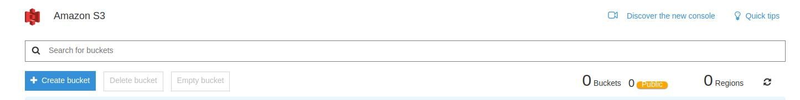
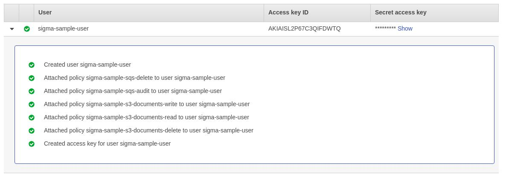

# Spring Boot in AWS

## AWS Environment
Amazon Web Services is a platform that provides on-demand cloud computing resources and their management, such as cloud object storage, virtual computer networks, container orchestration etc. Resourcces are separated into services. This document focuses on Elastic Compute Cloud (EC2), Simple Storage Service (S3), Simple Queue Service (SQS) and Elasticsearch Service.

Some of the AWS services are served in regions. Region is a name of the physical place where the data center(s) is located, e.g. North Virginia (us-east-1). Regions are completely isolated. Each of the regions has several availability zones, which are connected with low-latency links.

Users, roles, permissions and access management for the Amazon Web Services is provided by services calles Identity Access Management (IAM) .

Services can be configured in the AWS Console or by the AWS Web API. AWS Console is accessible at [AWS Management Console](https://console.aws.amazon.com/console/home). For the AWS Web API either AWS CLI or AWS SDK can be used. To use the Web API, user with programmatic access should be configured.

### Concepts

#### Identity Access Management

IAM defines users, roles and their permissions to Amazon Web Services.

IAM Policies defines ABAC-based access policies and is configured by a JSON, which can be built with AWS Web Console as a form. It contains an array of statements, each statement has it's effect: Allow or Deny, action: the action taken on the AWS resource, and resource on which the action is taken. Statement is applied if there's at least one Allow matching statement and no exlicit Deny statements. Policies are then used in roles, groups and users configuration.

Role is a set of policies that can be attached to either an AWS resource, e.g. EC2 instance, ECS task, or to the another AWS account.

Group unites user and applies a set of IAM policies to them.

User can be either added to a group with policies defined or to be created with a separate set of the IAM policies. Users can login to the AWS Console or to use the AWS Web API using access and private keys.

#### Elastic Compute Cloud

Elastic Compute Cloud provides virtual private servers in a cloud. Generally it's being used in a conjunction with the Virtual Private Cloud (VPC), Subnets, Security Groups.

VPC provides a logically isolated section of the cloud where resources are being launched. VPC is spread across regions. It combines IP address blocks, network subnets and security policies for traffic in the VPC etc. Usually application is being deployed in a single VPC.

Subnets defines virtual network configuration, which is equivalent to real networks and subnetting.

To configure traffic security rules Security Groups can be used. It defines an inbound and outbound rules for a port ranges and a source/destination which can be an IP address, IP address block or a Security Group. Security Group also defines what resources are accessible from the Internet.

EC2 instance is a virtual compute instance, with vCPU, RAM and dist storage attached. EC2 is being created based on Amazon Machine Image, which can be one of the pre-defined images such as CentOS, Red Hat or Windows Server, or a custom one. EC2 instance belongs to one VPC and has virtual network interfaces, these interfaces are connected to the subnets. EC2 instance also has a security group which defines network traffic security rules. Instances divided into types by virtual machine properties, e.g. vCPU, RAM, IOPS, network bandwidth. T2 instance type is the most commonly used for the web applications and microservice clusters 

#### Simple Storage Service

Simple Storage Service provides a cloud object storage, it stores files content with their metadata, which is called an object. Object Storage is organized into buckets, buckets contains objects. AWS Web API is used to create, read and delete objects. Object are immutable, but can be overridden if created with the key that is already exists in bucket.

AWS provides several features over the object storage, such as bucket and object logging, notification events, tagging, versioning, lifecycle policies etc. These features can be enabled during bucket creation.

AWS S3 has an option to create pre-signed URL's. It allows to grant access for objects manipulation to the third parties. For example, you generate an URL to create an object with the predefined key and metadata, and then user can upload a file to this URL to create an object without having an access to the bucket

#### Simple Queue Service

SQS provides message queue functionality and exposes a simple API to send and receive messages from queues. The API is accessed by AWS SDK or AWS CLI. Messages in SQS are durable meaning that SQS ensures that message is delivered at least once

There are two types of SQS queues: Standard and FIFO.

Standard queue has a nearly unlimited throughput, provides "at least once delivery", messages in this queue might be delivered in a different order as it has been sent. It is useful in cases the order of messages is not the requirement, and throughput is important. For example it can be used for batch processing or asynchronous independent tasks.

FIFO queue supports "exactly one time delivery", messages are strongly ordered by FIFO rule, provides limited throughout: 300 messages per second or 3000 messages per second in batch. It is applicable for command and event processing where the order is required.

SQS supports dead-letter queues. If message is not delivered several times it's being routed to the special queue, then monitoring and alerting can be configured for it. Dead-letter queues are good for tracing message delivery issues, especially in "saga" pattern scenarios.

SQS also provides message delivery delaying. It can be configured either on queue or on the particular message. Delayed messages are not delivered after the configured delay timeout elapse. Applicable for compensation strategies or in cases where an action rollback might be required.

Messages in SQS follows the next lifecycle. After message is sent it is not available until the cpnfigured delay timeout elapse. If no delay is configured, message is available immediately. When some of the consumers receive the message, it's being locked for the configured visibility timeout, this prevents messages from consuming twice. Consumer should delete message from queue explicitly. If message is not deleted within the visibility timeout, it's being marked as "not delivered", and after some number of attempts it goes to the dead-letter queue.

#### Elasticsearch Service

Elasticsearch Service provides managed Elasticsearch clusters in the AWS cloud. It allows to create multiple ES clusters, configure number and type of the ES instances in cluster and access rules to it.

Elasticsearch is a storage engine database. The most common use case for it is to provide full-text search on the documents. ES is rarely used as primary database, but rather as an index of the data stored in a relational or a document database.

ES stores data in documents which contains key-value pair called "field" with the few exceptions, e.g. nested documents. Documents are than organized into an index. Each index has a fields mapping which is the document type, it contains fields data types, analyzing and indexing preferences. In version prior to Elasticsearch 6.0 there was a possibility to create multiple document mappings per single index, but currently it's deprecated and only one document type per index (usually named "_doc") is supported.

There are 12 base type in Elasticsearch, simple types: text, keyword, date, long, double, boolean and ip; complex types: object and nested; specialized types: geo_point, geo_shape and completion. Notice the difference between text and keyword types, both are strings. But a text fields are analyzed, so going through an analyzer which splits the text into words and these fields are being searched on a word-basis. As an opposite, keyword field being matched as a whole string and these fields are not analyzed. By default, when object is indexed without explicit mapping set, string values produce mapping for two fields: text and keyword, which enables both full-text and term search on a string value.

ES supports (and prefers) distributed cluster setup. It supports both replication and sharing, which can be configured on the documents index level.

Elasticsearch does not provide any authentication and authorization out of the box. It only can be enabled either by plugins, such as ES X-Pack or by http proxies in front of ES instance, e.g. nginx proxy with basic authentication. The other option to secure ES from unauthorized access is to place it in a separate virtual subnet and let only selected hosts to access this subnet

#### Elastic Beanstalk

Elastics Beanstalk is a service that provides a manged environment to run applications without additional setup. It provides a simple way to configure cluster of EC2 instances, environment with different AWS services, load balancing, etc., and to run applications uploaded to S3. Configuration consists of the application, an executable file, and the environment, a managed piece of the AWS resources.

Elastic Beanstalk is able to run java applications, it supports war and executable jar archives. Java application execution can be controlled with "Proc" files, build controlled by "Buildfile" configuration

### Creating Publish Application Environment

This guide follows through the AWS Console. You need to have an enabled account in the Amazon Web Services. Environment setup provided here is a free tier eligible for fresh AWS accounts, but you should pay attention on what you're creating to not be billed extra. You can view you current expenses on the Billing dashboard. To access in, navigate to Services->Billing->Dashboard, or click on your account name in the top right corner and go to My billing dashboard.


It takes some time to update expenses, so recent changed may not be reflected. You can also configure budget notifications, AWS will send an email when your bill reaches certain point. To configure it go to Services->Billing->Budgets and create a new budget


It's preferred to use the same region for all services created here to avoid an extra billing for data transfer


#### S3 Bucket

To create an S3 bucket navigate to Services->S3 and click on Create Bucket



Then Configure bucket name and region. In this sample we use "sigma-sample-publish-app-documents" and region us-east-1. Name of the bucket should be AWS-wide unique


On the properties tab we can select extra functionality for the bucket. In this sample it is not used. Properties can be configured later on the bucket page


On the permissions tab access control is configured. It allows to grant access to another AWS account or to make it public. For this sample we'll configure detailed policies in the IAM service, here we can leave only private access by the owner


Then we can review and save new bucket configuration


#### SQS Queues

Our sample application uses 2 queue, the one is for documents audit and the other is for documents deletion.

##### Audit Queue

Audit queue contains messages with document creation start events, and is used for the compensation strategy. Publish service verifies that both file and metadata were uploaded successfully or cleanup incomplete publish. Audit queue must be delayed, and the delay must be greater than S3 upload url expiration timeout to avoid documents upload after the publish service processes the message. In this sample we'll use 15 minutes

To create the queue go to Services->SQS and click on Create New Queue button. If you're seeing just the welcome page, press the Get Started button.


First, you need to select queue name and region. We'll use the name "sigma-sample-audit-queue" and region us-east-1


Then select queue type. For audit we do not require particular message order since each message is independent and is processed separately. Select the Standard queue type


Then we need to configure queue delay. Click on the Configure Queue Button. In the opened pane change Delivery Delay to 15 minutes


and click Create Queue button. You should now be able to see the created queue


##### Delete Command Queue

Delete Command Queue is supposed to deliver deletion commands. Delete service handles these command and deletes documents and metadata. Delete Command Queue is not necessary to be a delayed, but delays might allow to create some sort of "undo" or "rollback" operation by deleting messages from queue. In this sample we will not use delays for Delete Command Queue. Let's name it "sigma-sample-delete-queue" and place it in the us-east-1 region. Create it as the previous one, except that the delay should be set to 0 seconds.


#### Elasticsearch Domain

For our application we need one ES index within one ES domain.

Before creating the Elasticsearch domain, we need to configure security group to limit access to the ES domain. To create the security group navigate to Services->VPC->Security Groups and click on Create Security Group

For the name use "sigma-sample-elasticsearch", type any meaningful description and select the default VPC


After Security group is created we need to configure inbound rules for it. To do it select created security group, in the bottom section open the Inbound Rules tab and click on Edit. Then configure this group to allow access from default VPC security group


In this case all resources in the default security group will have an access to the ES domain. To have more granular access control, you can create a separate security group for ES accessors and give inbound access only to this group. It's redundant for our sample. 

To create ES domain go to Services->Elasticsearch Service and click on Create New Domain


Then configure the domain. For the domain name we'll use "sigma-sample-metadata", version 6.2


After that, we need to configure ES cluster, we'll use 1 instance of type t2.small.elasticsearch, as it's available at the AWS Free Tier


As a store we're using EBS with General Purpose drive (SSD) with size of 10GB


And snapshot configuration can be left default


If everything is ok, click next button.

On the next page we need to configure ES cluster access.

There are 2 types of the access: VPC and Public. For the VPC access the ES endpoint will be exposed in the VPC subnet with a security group set. With the Public access, ES endpoints will be exposed to the internet and can be accessed by anyone, who pass the access policy defined later.

In our sample we configure VPC access. Select your default VPC, any of the subnet available, and the security group we created for ES before (sigma-sample-elasticsearch security group)

Skip Kibana authentication for now.

As we use Security Groups to limit access to the Elasticsearch, for Access policy we can select "Do not require signing request with IAM credential"


Request signing can be used as the one of the authentication methods. In this case separate user should be created and the AWS request signing interceptor needs to be configured for the Elasticsearch Rest Client

Click Next, review and if everything is ok, click Create. Elasticsearch Domain loading can take a few minutes to complete

#### IAM Policies, Roles and Users

IAM entities should follow the Principle of Least Privilege, meaning users and roles should get only required permissions to operate normally.

Let's create the following policies:
 * Write objects to S3 bucket "sigma-sample-publish-app-documents" (publish service)
 * Read objects from S3 bucket "sigma-sample-publish-app-documents" (search service)
 * Delete objects from S3 bucket "sigma-sample-publish-app-documents" (delete service)
 * Send, receive and delete messages from SQS queue and get it's URL "sigma-sample-audit-queue" (publish service)
 * Send, receive and delete messages from SQS queue and get it's URL "sigma-sample-delete-queue" (delete service)
 
To create an IAM policy go to Services->IAM->Policies and click Create Policy. You can use eigther Visual Editor or JSON editor


Here's JSON configuration for each policy

Write objects to S3 bucket "sigma-sample-publish-app-documents"
```json
{
    "Version": "2012-10-17",
    "Statement": [
        {
            "Effect": "Allow",
            "Action": "s3:PutObject",
            "Resource": "arn:aws:s3:::sigma-sample-publish-app-documents/*"
        }
    ]
}
```

Read objects from S3 bucket "sigma-sample-publish-app-documents"
```json
{
    "Version": "2012-10-17",
    "Statement": [
        {
            "Effect": "Allow",
            "Action": "s3:GetObject",
            "Resource": "arn:aws:s3:::sigma-sample-publish-app-documents/*"
        }
    ]
}
```

Delete objects from S3 bucket "sigma-sample-publish-app-documents"
```json
{
    "Version": "2012-10-17",
    "Statement": [
        {
            "Effect": "Allow",
            "Action": "s3:DeleteObject",
            "Resource": "arn:aws:s3:::sigma-sample-publish-app-documents/*"
        }
    ]
}
```

Send, receive and delete messages from SQS queue and get it's URL "sigma-sample-audit-queue"
```json
{
    "Version": "2012-10-17",
    "Statement": [
        {
            "Effect": "Allow",
            "Action": [
                "sqs:DeleteMessage",
                "sqs:GetQueueUrl",
                "sqs:ReceiveMessage",
                "sqs:SendMessage"
            ],
            "Resource": "arn:aws:sqs:us-east-1:************:sigma-sample-audit-queue"
        }
    ]
}
```
************** - is the account id. You can copy SQS queue ARN from Services->SQS queue details tab 

Send, receive and delete messages from SQS queue and get it's URL "sigma-sample-delete-queue"
```json
{
    "Version": "2012-10-17",
    "Statement": [
        {
            "Effect": "Allow",
            "Action": [
                "sqs:DeleteMessage",
                "sqs:GetQueueUrl",
                "sqs:ReceiveMessage",
                "sqs:SendMessage"
            ],
            "Resource": "arn:aws:sqs:us-east-1:652070750656:sigma-sample-delete-queue"
        }
    ]
}
```
************** - is the account id. You can copy SQS queue ARN from Services->SQS queue details tab

Then we'll create a user to illustrate AWS access using programmatic access credentials. Go to Services->IAM->Users and click Add User. Type the name for new user and select Programmatic Access to use it with SDK


After that we need to configure permissions. Select Attach Existing Policies, filter policies by "Customer Managed" and select all the created policies


Then click next, review, and click Create User. On the next screen wizard suggests to write down the Access Key Id and the Secret Key, save them in secure place. These credential will never be accessible again



From now on AWS Web API can be accessed using this credentials

#### Beanstalk Environment

We need to create an environment to run our application. Before proceeding to Beanstalk environment itself, we need to generate EC2 ssh key pair, to access EC2 instances created by Beanstalk. Go to Services->EC2->Key Pairs and click Create Key Pair. Enter the name "sigma-sample-eb" and click Create


After you click create, SSH key file will be automatically downloaded. Save it in secure place, it will never be accessible again. If you're running Linux or MacOS make sure file has 400 access modifier, it can be changed using `chmod 400 sigma-sample-eb.pem`

As a starting point, we'll deploy sample application provided by AWS Beanstalk. Go to Services->Elastic Beanstalk and click Create Application. Or if you see a welcome screen press the Get Started button


Next, choose the application name, we'll use "sigma-sample-publish-app", select Java platform and Sample application for source code


Then click on Configure More Options. Here you can review environment being created. Ensure that Low price configuration is selected. Now we need to customize instance security groups. Go to Instances->Modify and select default security group for EC2 instances as it has an access to the Elasticsearch. Everything else should be left as a default


And we need to set SSH key pair to make EC2 instances accessible via SSH. Navigate to Security->Modify. For virtual machine permissions EC2 key pair select previously created key pair "sigma-sample-eb" and click Save


Then click Create app and wait until environment will be instantiated. If everything is ok, you will be redirected to application dashboard


## Development Process

### AWS Access from Java SDK

Amazon Web Services provides the AWS SDK for Java to access AWS resources from Java code. Currently the latest stable version is 1.11.327. It's accessible from Maven Central
```xml
<dependency>
    <groupId>com.amazonaws</groupId>
    <artifactId>aws-java-sdk-core</artifactId>
    <version>1.11.327</version>
</dependency>
``` 

Together with the code dependency, dependencies for each AWS service should be included. For example, to include S3 dependency

```xml
<dependency>
    <groupId>com.amazonaws</groupId>
    <artifactId>aws-java-sdk-s3</artifactId>
    <version>1.11.327</version>
</dependency>
```

To use AWS Services in Spring we need to expose it as a beans. For example for AmazonS3 service
```java
@Bean
public AmazonS3 amazonS3(
        @Value("${aws.s3.region}") String region) {

    AmazonS3ClientBuilder amazonS3ClientBuilder = AmazonS3ClientBuilder.standard()
            .withCredentials(new DefaultAWSCredentialsProviderChain())
            .withRegion(region);

    return amazonS3ClientBuilder.build();
}
```
Notice the `DefaultAWSCredentialProviderChain`, it is a chain of `EnvironmentVariableCredentialsProvider`, `SystemPropertiesCredentialsProvider`, `ProfileCredentialsProvider` and `EC2ContainerCredentialsProviderWrapper`. You can read about their behaviour in the Javadoc of the corresponding classes.

It is also useful to import AWS credentials from Spring configuration. So we can create our credentials provider chain

```java
public class SpringPropertiesCredentialsProvider implements AWSCredentialsProvider {

    private static final String PROPERTY_ACCESS_KEY_ID = "aws.accessKeyId";
    private static final String PROPERTY_SECRET_KEY = "aws.secretKey";

    private final Environment environment;

    public SpringPropertiesCredentialsProvider(Environment environment) {
        this.environment = environment;
    }

    @Override
    public AWSCredentials getCredentials() {
        String accessKeyId = environment.getProperty(PROPERTY_ACCESS_KEY_ID);
        String secretKey = environment.getProperty(PROPERTY_SECRET_KEY);
        if (accessKeyId == null || secretKey == null) {
            throw new IllegalStateException("Unable to locate credentials in spring properties");
        }

        return new BasicAWSCredentials(accessKeyId, secretKey);
    }

    @Override
    public void refresh() {
    }
}
```

And expose it as a bean together with the rest of the default chain

```java
@Bean
public AWSCredentialsProvider awsCredentialsProvider(Environment env) {
    return new AWSCredentialsProviderChain(
            new SpringPropertiesCredentialsProvider(env),
            new EnvironmentVariableCredentialsProvider(),
            new SystemPropertiesCredentialsProvider(),
            new ProfileCredentialsProvider(),
            new EC2ContainerCredentialsProviderWrapper()
    );
}
```

Now we can import this provider as a bean dependency for AWS services

```java
@Bean
public AmazonS3 amazonS3(
        @Autowired AWSCredentialsProvider credentialsProvider,
        @Value("${aws.s3.region}") String region) {

    AmazonS3ClientBuilder amazonS3ClientBuilder = AmazonS3ClientBuilder.standard()
            .withCredentials(credentialsProvider)
            .withRegion(region);

    return amazonS3ClientBuilder.build();
}
```

Then AWS credentials can be set in any way defined in the chain: spring properties, env variable, system properties, AWS profile and EC2 credentials. Other AWS services can be exposed in the similar way

Then you can autowire service bean

```java
@Autowired
private AmazonS3 amazonS3;
```

### Localstack
Localstack is an open-source project that supports mocking of the AWS services. It has mocks for most common services, such as S3, SQS, Elasticsearch Service. It's being constantly extended and still under an active development. More details on installation can be found here [localstack/localstack GitHub](https://github.com/localstack/localstack)

To be able to use localstack endpoints instead of real AWS endpoints we need to add endpoint configuration to the AWS service Spring beans in our application. For S3 it is

```java
@Bean
public AmazonS3 amazonS3(
        @Autowired AWSCredentialsProvider credentialsProvider,
        @Value("${aws.s3.region}") String region,
        @Value("${aws.s3.endpointUrl:}") String endpointUrl,
        @Value("${aws.s3.pathStyleAccess:false}") Boolean pathStyleAccess) {

    AmazonS3ClientBuilder amazonS3ClientBuilder = AmazonS3ClientBuilder.standard()
            .withCredentials(credentialsProvider)
            .withPathStyleAccessEnabled(pathStyleAccess);

    if (StringUtils.isEmpty(endpointUrl)) {
        amazonS3ClientBuilder.setRegion(region);
    } else {
        amazonS3ClientBuilder.setEndpointConfiguration(
                new AwsClientBuilder.EndpointConfiguration(endpointUrl, region)
        );
    }

    return amazonS3ClientBuilder.build();
}
```

We need to enable path-style access to the S3, because by default client works with domain name style bucket path, which is not available in Localstack. It can also be required in other AWS services

### Accessing Elasticsearch

Elasticsearch supports 2 connection types: transport and REST, while transport client is being deprecated by Elasticsearch, REST client is the recommended way to connect the Elasticsearch. AWS Elasticsearch supports only the REST connection type. Elasticsearch has 2 client for the REST API: Low-level and High-level Rest Clients. In the sample we're using High-level Rest Client as it provides a DSL for the ES requests and is more understandable.

To expose the Elasticsearch client we can use FactoryBean, as it will allow to gracefully close the client

```java
@Component
public class ElasticsearchClientFactoryBean implements FactoryBean<RestHighLevelClient> {

    @Value("${elasticsearch.url}")
    private String esUrl;
    @Value("${elasticsearch.connectTimeout}")
    private int esConnectTimeout;
    @Value("${elasticsearch.socketTimeout}")
    private int esSocketTimeout;

    private RestHighLevelClient esClient;

    @PostConstruct
    public void init() {
        this.esClient = buildClient();
    }

    @Override
    public RestHighLevelClient getObject() {
        return this.esClient;
    }

    @PreDestroy
    public void close() throws Exception {
        this.esClient.close();
    }

    @Override
    public Class<?> getObjectType() {
        return RestHighLevelClient.class;
    }

    @Override
    public boolean isSingleton() {
        return true;
    }

    private RestHighLevelClient buildClient() {
        return new RestHighLevelClient(
                RestClient.builder(HttpHost.create(esUrl))
                        .setRequestConfigCallback(requestConfigBuilder ->
                                requestConfigBuilder
                                        .setConnectTimeout(esConnectTimeout)
                                        .setSocketTimeout(esSocketTimeout)
                        )
                        .setMaxRetryTimeoutMillis(esSocketTimeout)
        );
    }
}
```

And then it can be autowired

```java
@Autowired
private RestHighLevelClient esClient;
```

Elasticsearch in AWS environment is placed in the isolated Security Group, and it's not accessible from outside of the cluster. To be able to connect the Elasticsearch at Kibana at AWS we can use "Bastion Host" approach. Bastion host is a machine instance or server instance which is located in DMZ (Demilitarized zone), performs user authorization and proxies requests into the private network. It can be an HTTP Proxy, an SSH Agent with port forwarding etc.

To connect our ES instance we can use a separate EC2 micro instance in the "default" Security Group as a Bastion host. But there's only one micro instance available at the Free Tier, so we will use instance created by the Beanstalk. To do this go to the AWS Console Services->EC2->Instances. Find the instance created for Beanstalk environment and copy instance public ip. Ensure that SSH port is allowed in the instancce Security Group. Then you need to get ES domain url, go to Services->Elasticsearch Serices, select sigma-sample-metadata domain, and copy VPC endpoint domain name (without https:// part). AWS ES VPC endpoint exposes 2 rest endpoints: http on port 80 and https on port 443. We'll use http, because we'll access it through the different domain (localhost) and in this case java will not trust the endpoint https certificate, so java should be additionaly configured

Basic ssh port forwarding command is the following

```bash
ssh <instance-user>@<instance-address> -L <local_port>:<forwarding_remote_address>:<forwarding_remote_address>
```

Command will create an ssh tunnel, opening `<local_port>` at the local machine and forwaring all the requests from local port to the `<forwarding_remote_address>` address and port `<forwarding_remote_port`

In our use case command is

```bash
ssh -i sigma-sample-eb.pem ec2-user@xxx.xxx.xxx.xxx -L 8080:vpc-sigma-sample-metadata-xxxxxxxxxxxxxxxxxxxxxxxxxx.us-east-1.es.amazonaws.com:80
```

After connection established ES will be accessible at http://localhost:8080 and Kibana is accessible at http://localhost:8080/_plugin/kibana

## Deployment

We deploy our application to the AWS Beanstalk. Previously we created Beanstalk application and environment. Next, we need to create a java application configuration. It can be done by using "Proc" file. We have 3 applications build in executable jar archives: publish-svc-1.0.jar, search-svc-1.0.jar and delete-svc-1.0.jar. Let's create Proc file for the application in a separate folder

```
publish_svc: java -jar -Xms64m -Xmx64m -Djava.security.egd=file:/dev/./urandom -Dspring.config.location=classpath:/application.yml,publish-svc.yml publish-svc-1.0.jar
search_svc: java -jar -Xms64m -Xmx64m -Djava.security.egd=file:/dev/./urandom -Dspring.config.location=classpath:/application.yml,search-svc.yml search-svc-1.0.jar
delete_svc: java -jar -Xms64m -Xmx64m -Djava.security.egd=file:/dev/./urandom -Dspring.config.location=classpath:/application.yml,delete-svc.yml delete-svc-1.0.jar
```

And application configuration files

publish-svc.yml
```yaml
server.port: "${PORT}"
storage:
  indexName: documents-metadata
  bucketName: sigma-sample-publish-app-documents
  uploadUrlExpireTimeout: 300_000
  auditEventQueue: sigma-sample-audit-queue
  auditPollTimeout: 1_000
aws:
  s3.region: us-east-1
  sqs.region: us-east-1
  accessKeyId: xxxxxxxxxxxxxxxxxxxx
  secretKey: xxxxxxxxxxxxxxxxxxxxxxxxxxxxxxxxxxxxxxxx
elasticsearch:
  url: https://vpc-sigma-sample-metadata-xxxxxxxxxxxxxxxxxxxxxxxxxx.us-east-1.es.amazonaws.com
  connectTimeout: 1_000
  socketTimeout: 30_000
```

search-svc.yml
```yaml
server.port: "${PORT}"
storage:
  indexName:   documents-metadata
  bucketName: sigma-sample-publish-app-documents
  downloadUrlExpireTimeout: 300_000
aws:
  s3.region: us-east-1
  sqs.region: us-east-1
  accessKeyId: xxxxxxxxxxxxxxxxxxxx
  secretKey: xxxxxxxxxxxxxxxxxxxxxxxxxxxxxxxxxxxxxxxx
elasticsearch:
  url: https://vpc-sigma-sample-metadata-xxxxxxxxxxxxxxxxxxxxxxxxxx.us-east-1.es.amazonaws.com
  connectTimeout: 1_000
  socketTimeout: 30_000
```

delete-svc.yml
```yaml
server.port: "${PORT}"
storage:
  deleteCommandQueue: sigma-sample-delete-queue
  deletePollTimeout: 1_000
  indexName:   documents-metadata
  bucketName: sigma-sample-publish-app-documents
aws:
  s3.region: us-east-1
  sqs.region: us-east-1
  accessKeyId: xxxxxxxxxxxxxxxxxxxx
  secretKey: xxxxxxxxxxxxxxxxxxxxxxxxxxxxxxxxxxxxxxxx
elasticsearch:
  url: https://vpc-sigma-sample-metadata-xxxxxxxxxxxxxxxxxxxxxxxxxx.us-east-1.es.amazonaws.com
  connectTimeout: 1_000
  socketTimeout: 30_000
```

Elastic Beanstalk exposes endpoints through the nginx proxy. To get the port nginx listening to, we're using `server.port: "${PORT}"` in the configuration

By default, only the first application will be exposed. To change it we need to extend nginx configuration. Create file under .ebextensions/nginx/conf.d/ with name 00_application.conf and paste the configuration
```nginx
server {
    server_name .elasticbeanstalk.com;
    listen 80;

    location /publish {
        proxy_pass          http://127.0.0.1:5000;
        proxy_http_version  1.1;

        proxy_set_header    Connection          $connection_upgrade;
        proxy_set_header    Upgrade             $http_upgrade;
        proxy_set_header    Host                $host;
        proxy_set_header    X-Real-IP           $remote_addr;
        proxy_set_header    X-Forwarded-For     $proxy_add_x_forwarded_for;
    }

    location /search {
        proxy_pass          http://127.0.0.1:5100;
        proxy_http_version  1.1;

        proxy_set_header    Connection          $connection_upgrade;
        proxy_set_header    Upgrade             $http_upgrade;
        proxy_set_header    Host                $host;
        proxy_set_header    X-Real-IP           $remote_addr;
        proxy_set_header    X-Forwarded-For     $proxy_add_x_forwarded_for;
    }

    location /delete {
        proxy_pass          http://127.0.0.1:5200;
        proxy_http_version  1.1;

        proxy_set_header    Connection          $connection_upgrade;
        proxy_set_header    Upgrade             $http_upgrade;
        proxy_set_header    Host                $host;
        proxy_set_header    X-Real-IP           $remote_addr;
        proxy_set_header    X-Forwarded-For     $proxy_add_x_forwarded_for;
    }
}
```

So, publish service will be accessible under `http://<machine-address>/publish`, search is under `http://<machine-address>/search`, and delete is under `http://<machine-address>/delete`

Then package together the compiled jar files, config files and the Procfile into a single zip archive. Go to AWS Console->Services->Elastic Beanstalk->sigma-sample-publish-app->SigmaSamplePublishApp-env-1 and click Upload and Deploy. Select packaged zip file, write something to the version label field, e.g. current date and time and press Deploy. After some time your java application will be deployed to the Beanstalk instance.


AWS EC2 t2.micro instance doing really bad on running 3 java applications. If you're experiencing some troubles with the deployment performance you can try to deploy just one of the applications, excluding 2 of them from the Procfile

Now you can access services under `http://<machine-address>/publish`, `http://<machine-address>/search` and `http://<machine-address>/delete`